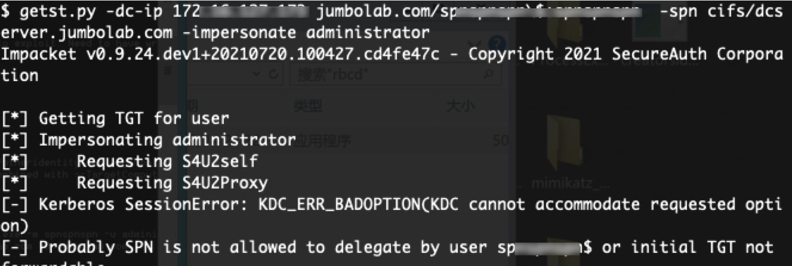
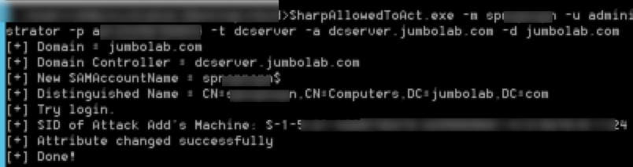
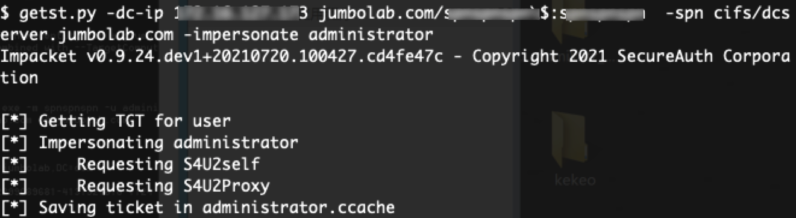
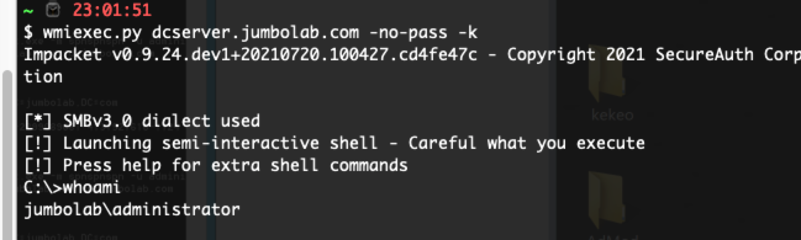

# 介绍

本项目复制于[SharpAllowedToAct](https://github.com/pkb1s/SharpAllowedToAct)，因为有的时候可能只是拿到了一个特殊用户的账号密码，却没有这台用户所在机器的权限，想利用获取到的特殊账号（如加域账号）进行基于资源的约束委派的攻击，而`SharpAllowedToAct`只是使用了当前的用户权限去做攻击，因此我做了以下更改：

1、删除了添加机器账号的操作，可以用原来的`SharpAllowedToAct`进行添加，又或者使用`addcomputer.py`进行机器账号的添加

2、添加了自定义LDAP账号密码参数

3、添加了指定机器账号参数

# 使用方法

默认`msds-allowedtoactonbehalfofotheridentity`没有指定，因此申请票据失败：



利用本项目的工具进行修改受害者的`msds-allowedtoactonbehalfofotheridentity`属性：



其中-m参数为你添加的机器账号，-u为ldap账号，-p为ldap密码，-t为准备要攻击的机器名，-a为域控地址，-d为域名，如：

```
SharpAllowedToAct.exe -m machine -u ldapuser -p ldappass -t victim -a dcserver.domian.com -d domain.com
```

此时申请票据成功：



RBCD成功连接victim机器：


